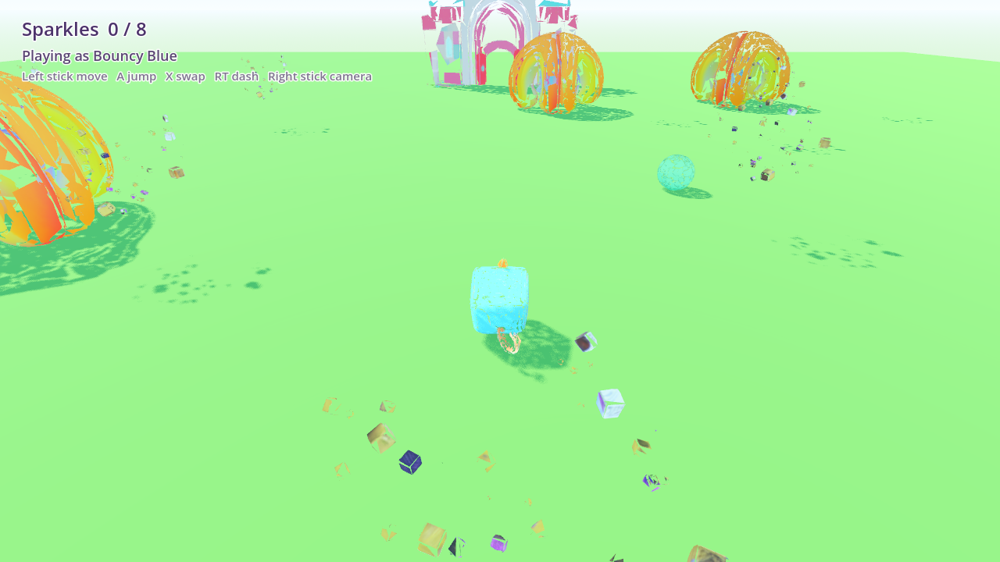

# Rainbow Sparkle Squad

A pastel toybox playground for Godot 4.7, built for a three-year-old and a
controller. A meadow hub with six learning islands behind doors: counting,
number order, shapes, phonics, size comparison, descriptive observation, and
reading feelings off a face.

**If you are an AI agent picking this project up, read
[Working on this project](#working-on-this-project) and especially
[Traps](#traps-read-this-before-you-write-code) before writing any code.** The
traps section is not general advice — every item on it is a bug this project
has already shipped and paid for, and most of them fail *silently*.

**Contents**

- [Working on this project](#working-on-this-project)
- [Traps](#traps-read-this-before-you-write-code)
- [Recipes](#recipes)
- [Architecture](#architecture)
- [The worlds](#the-worlds)
- [Controls](#controls)
- [Known rough edges](#known-rough-edges)

---

# Working on this project

## Environment

Nothing here is on `PATH`. These exact paths are what the tools expect.

```bash
# Godot 4.7. Note the folder is NAMED like an exe - that is not a typo.
GODOT="/c/Users/joshu/Downloads/Godot_v4.7-stable_win64.exe/Godot_v4.7-stable_win64.exe"
GODOT_CONSOLE="/c/Users/joshu/Downloads/Godot_v4.7-stable_win64.exe/Godot_v4.7-stable_win64_console.exe"

# Python with trimesh/numpy/scipy, at the REPO ROOT (not in rainbow-sparkle-squad/)
PY="/c/Users/joshu/Documents/barony/.venv/Scripts/python.exe"
```

Blender lives at `C:\Program Files\Blender Foundation\Blender 5.2\blender.exe`
and is hard-coded as `BLENDER` in `tools/import_assets.py`.

**Always use `GODOT_CONSOLE` for anything headless.** The plain exe detaches
from the console and you will see no `print()` output at all — a test that
"produces nothing" is usually just the wrong exe.

ComfyUI runs at `http://127.0.0.1:8000` (not the default 8188). Check it is up
before generating anything:

```bash
curl -s -m 5 http://127.0.0.1:8000/system_stats
```

Its input/output folders are `C:\Users\joshu\Documents\ComfyUI\input` and
`...\output`, and the two workflows this project drives are in
`C:\Users\joshu\Documents\ComfyUI\user\default\workflows\`:
`flux_schnell_concept_art.json` and `trellis2_geometry_texture_fixed.json`.

## The commands you need

```bash
cd /c/Users/joshu/Documents/barony

# Play it
"$GODOT" --path rainbow-sparkle-squad

# Re-import assets after adding or changing any .glb/.wav. Do this before tests.
"$GODOT_CONSOLE" --headless --path rainbow-sparkle-squad --import

# Run one test suite
"$GODOT_CONSOLE" --headless --path rainbow-sparkle-squad -s tools/playtest.gd

# Screenshot the meadow (frames, output path)
"$GODOT_CONSOLE" --path rainbow-sparkle-squad -s tools/shoot.gd -- 200 shot.png

# Screenshot an island - same travel a door does, so it restarts and speaks
"$GODOT_CONSOLE" --path rainbow-sparkle-squad -s tools/shoot.gd -- 200 shot.png haunted

# Look at one model from four angles - the authoritative model check
"$GODOT_CONSOLE" --path rainbow-sparkle-squad -s tools/turntable.gd -- trex out/tt.png
```

Screenshot and turntable tools need a real framebuffer, so run them **without**
`--headless`.

## Before you commit: run all nine suites

```bash
for t in playtest bunnytest butterflytest blocklandtest \
         shapecovetest letterlagoontest dinovalleytest safaritest \
         hauntedhousetest; do
  "$GODOT_CONSOLE" --headless --path rainbow-sparkle-squad -s tools/$t.gd \
    2>&1 | grep -E "$t:|FAIL"
done
```

Expected, as of the last commit:

```
playtest: 8/8      bunnytest: 5/5        butterflytest: 6/6    blocklandtest: 10/10
shapecovetest: 11/11   letterlagoontest: 13/13   dinovalleytest: 14/14   safaritest: 14/14
hauntedhousetest: 22/22
```

Every suite exits non-zero on failure. If you add an island, add a suite.

## The working loop

1. Change code or add an asset.
2. `--import` if any asset changed.
3. Run the affected suite, then all eight.
4. **Render a screenshot and actually look at it.** Most of the bugs this
   project has hit were invisible to the tests and obvious in a render — a
   whole biome facing the wrong way, water drawn over an island, neighbours on
   the horizon. Tests prove logic; only a picture proves it looks right.
5. Commit with a message that says *why*, not just what.

## Verify your commit landed

`git add` is **atomic**: one bad pathspec and *nothing* in that command is
staged. This has already produced a commit containing a new character with no
code path spawning it. After committing, check the thing you added is really in
the tree:

```bash
git show HEAD:rainbow-sparkle-squad/scripts/Game.gd | grep -c '_build_myisland'
git status --short          # should be clean apart from deliberate leftovers
```

---

# Traps: read this before you write code

Each of these has already cost this project a real bug. They fail quietly.

### 1. `Area3D.body_entered` only fires on a *crossing*

If a new round begins while the player is already standing inside the answer,
**no event will ever arrive** and the game deadlocks with no way out but walking
off and back on. Finish "sat" standing on the `t`, and "tin" wants `t` first.

Every game with rounds calls `_claim_overlaps()` at the round boundary — see
`Blockland`, `LetterLagoon`, `ShapeCove`, `DinoValley`, `SafariPlains`. Copy it.
Cost: three separate bugs before it was handled by default.

### 2. Never put a timed cooldown on a touch handler

`body_entered` cannot double-fire, so a cooldown protects against nothing — but
it *does* silently swallow a legitimate touch when a child walks briskly from
one block to the next. Guard with state (`is_lit()`), never with a timer.

### 3. Layout tables hold LOCAL offsets; movement code steers in WORLD space

`RoamingAnimal` uses `global_position` and `move_and_slide`. A biome's layout
table naturally holds offsets relative to the biome. Convert when you build:

```gdscript
animal.home = global_position + spec["home"]   # correct
animal.home = spec["home"]                     # sends it to the meadow, 800m away
```

Symptom: the biome looks fine for three seconds and then quietly empties.

### 4. Everything washes out under the meadow sun

The lighting and filmic tonemap lift every colour well past its swatch, and
generated models arrive with studio lighting already baked into the albedo.

- **Ground planes:** pick a colour that looks *too dark* in the picker.
- **Pale characters:** call `Models.tint_albedo(visual, tint)` — see `Bunny`,
  `Butterfly`. Without it a pale animal renders as a flat white blob.

### 5. Generated models face `+Z`; Godot's forward is `-Z`

`Models.spawn()` applies `MODEL_YAW = PI` for you. When you place something so
it faces the middle of a ring, that is:

```gdscript
node.rotation.y = atan2(pos.x, pos.z)          # correct - faces inward
node.rotation.y = atan2(pos.x, pos.z) + PI     # faces OUT of the ring
```

The extra `PI` shipped once and gave a plaza of ten Numberblocks showing their
backs to anyone who walked in.

### 6. Blender is Z-up; the GLB is Y-up

Inside `rig_wings.py`, a model that sits on `y = 0` in the GLB stands on
`z = 0` in Blender. Bone coordinates transpose. Getting it wrong builds a rig
that looks plausible and animates sideways.

### 7. A Blender bone's local **Y** runs along the bone

So a wing beat is a roll about `Vector3.UP` in bone space, *not* the wing's
world direction. Both wings take the **same** local sign — their rest frames
are already mirrored, and negating one folds them the same way. Verify a rig by
rendering a few frames of the beat, never by reasoning about it.

### 8. Water must sit below the island it surrounds

An island top is `y = 0`. A water disc centred at `y = -0.1` with height `0.3`
has its surface at `+0.05` and hides the entire island. Keep the surface under
zero — see `ShapeCove._build_water`.

### 9. Tests must wait on STATE, not on the clock

Headless runs idle frames as fast as the machine allows while physics stays
pinned at 60 Hz, so any fixed delay between test steps is a race. Every suite
here uses a step table with a `ready` predicate and a generous timeout.

This matters more than it sounds: a clock-timed test reported a **real**
deadlock bug as "flaky timing", and rewriting it to poll state made the bug
reproduce identically three runs in a row.

Also: give steps a timeout longer than the game's own pacing. Shape Cove takes
about 8 s to play through by design, so a 6 s timeout fails a working game.

### 10. Rigged assets must stay OUT of `import_assets.ASSETS`

`butterfly` and `pteranodon` have an extra stage: decimate to scratch, then
`rig_wings.py`. Listing them in `ASSETS` lets a plain `import_assets.py` run
overwrite the rigged GLB with an unrigged one and **silently stop the wings**.
The exclusion and both source timestamps are commented in that file.

### 11. Camera far plane vs island spacing

Islands sit `ISLAND_SPACING = 800` apart and `FollowCamera.FAR = 300`. Keep the
far plane comfortably under the gap, or a child on the savanna sees a volcano
and a pastel meadow parked on the horizon. If you add an island, put it on the
same spacing grid.

### 12. Screenshot tools build their own camera

A throwaway `Camera3D` does **not** inherit `FollowCamera.FAR`, so a shot can
show neighbours a player would never see. Set `cam.far = FollowCamera.FAR`. A
screenshot that flatters the game is worse than no screenshot.

### 13. Check the wall clock before writing a `-newermt` waiter

A background waiter written with a mark a few hours in the future can never
match and will wait forever. `date` first.

### 14. TRELLIS can reconstruct the BACKGROUND, not just a floor

`import_assets.py` says these concepts are generated on plain backgrounds so
there is nothing to cut. That is true of *most* of them. One sleepy-ghost
concept came back with a slightly darker, cloudier backdrop,
`Trellis2RemoveBackground` failed to cut it, and the mesh arrived with the
**whole backdrop welded on as a flat slab standing behind the subject**.

It fails silently and `strip_floor` will not save you — that looks for a wide
thin component *at the bottom*, and this one is vertical. Nor do the extents
give it away: the slab sits behind the subject, so the bounding box still looks
like a plausible chunky object. Width x depth x height came back
1.00 x 0.95 x 0.63 where a good ghost is 1.00 x 0.72 x 0.84 — deeper and
shorter, which is the slab standing behind and the ghost shrinking to fit the
unit cube beside it, but nothing a threshold would catch. What it does do is
make the slab the widest thing in the mesh, so `Models.spawn`'s auto-fit scales
to the SLAB and the character comes out a fraction of its intended size.

The only thing that catches it is looking at the model. Prefer a concept whose
background is uniform and *light*; if a render shows a slab, re-roll on another
of the four candidates rather than trying to cut it out.

---

# Recipes

## Add a new island

Islands are built in code, live far off in world space, and are reached by a
door pair. Adding one touches four files.

1. **`scripts/MyIsland.gd`** — `class_name MyIsland extends Node3D`. Build the
   ground as a `StaticBody3D` cylinder whose top is `y = 0`, then its contents.
   Emit `round_started(text)`, `answered(correct, key)` and `completed`, and
   expose `restart()`, `question()`, `round_index()`, `is_complete()`.
   Copy `ShapeCove.gd` (find-the-one) or `LetterLagoon.gd` (in-order) —
   whichever loop shape fits — and keep `_claim_overlaps()` (trap 1).

2. **`scripts/Game.gd`** — four small edits. Six of the eight slots on the
   spacing grid are taken; `(-S, 0, -S)` and `(+S, 0, -S)` are still free:
   ```gdscript
   const MYISLAND_ORIGIN := Vector3(-ISLAND_SPACING, 0, -ISLAND_SPACING)
   const MYISLAND_DOOR := Vector3(x, 0, z)          # somewhere near meadow spawn
   # in ARRIVALS:
   "myisland": MYISLAND_ORIGIN + Vector3(0, 1.2, 14.0),
   ```
   then in `_build_islands()` construct it, connect its signals, and add the
   door pair:
   ```gdscript
   _door("DoorToMyIsland", "My Island", "myisland", MYISLAND_DOOR, yaw, Color("#hex"))
   _door("DoorFromMyIsland", "Meadow", "meadow",
         MYISLAND_ORIGIN + Vector3(0, 0, 16.0), 0.0, Color("#hex"))
   ```
   and a `"myisland": _myisland.restart()` arm in `_travel()`.

3. **`tools/myislandtest.gd`** — copy `safaritest.gd`. Keep its shape: static
   data checks first, then a state-driven step table. Assert the *claims your
   questions make* (trap 9 rationale), and assert everything is still inside
   `GROUND_R` after roaming (trap 3).

4. **README** — add a section under [The worlds](#the-worlds).

Travel is destination-driven, so nothing in `_travel()`/`_on_portal_entered()`
needs to know how many islands exist.

## Add a roaming animal to an existing biome

Add a row to that biome's layout dictionary. No new code:

```gdscript
"rhino": {
    "h": 1.9, "home": Vector3(4, 0, -8), "roam": 6.0, "count": 1,
    "speed": 1.2, "gait": 1.1, "roll": 0.07, "pause": Vector2(2.0, 5.0),
},
```

`speed`/`gait`/`roll`/`pause` are the whole difference between an elephant and
a zebra. You also need `assets/models/rhino.glb`, `assets/audio/animal_rhino.wav`
and `assets/audio/roar_rhino.wav`.

## Add a generated model

```bash
# 1. Concept: copy flux_schnell_concept_art.json, replace node 2's text
#    (CLIPTextEncode), node 5's seed (KSampler), node 7's filename_prefix
#    (SaveImage). Submit via the comfy MCP run_workflow. Four images come out.
# 2. Look at all four. Pick one with limbs SEPARATED and the key feature clear -
#    voxel reconstruction fuses touching limbs into a lump.
# 3. Copy it to ComfyUI/input, point trellis2_geometry_texture_fixed.json's
#    node 1 (LoadImage) at it, run. ~2-4 min per model.
# 4. Decimate:
"$PY" -c "
import sys; sys.path.insert(0, r'rainbow-sparkle-squad/tools')
import import_assets as ia, os
ia.process(os.path.join(ia.SRC, 'trellis2_YYYYMMDD_HHMMSS.glb'),
           'myname', 14000, r'rainbow-sparkle-squad/assets/models', dry_run=False)
"
# 5. Record the source timestamp in import_assets.ASSETS so it is reproducible.
# 6. --import, then turntable it and LOOK at it.
```

Prompt rules that matter, learned the hard way:

- **Pose is permanent.** Nothing is rigged, so whatever comes out of TRELLIS is
  the pose forever. Ask for legs *clearly separated with gaps between them*.
- **No ground plane, no cast shadow.** A visible surface is reconstructed as
  welded floor geometry that dominates the bounding box.
- **Name the feature a question will ask about.** The safari questions are
  claims about the models; a giraffe without an obviously long neck makes its
  round unanswerable.
- Append the house style suffix — see any `make_*` prompt or the `gen_*` blocks
  in git history for the exact wording.

## Add a rigged (winged) model

Only for creatures whose **wings must beat**, which no whole-body transform can
do. Generate with wings spread, flat and symmetric about the centre plane.

```bash
# Decimate to SCRATCH, not to assets/models
"$PY" -c "...ia.process(src, 'myname_unrigged', 12000, r'<scratch>', dry_run=False)"

# Rig: HINGE_IN and HINGE_OUT are fractions of the half-wingspan
"$BLENDER" -b -P rainbow-sparkle-squad/tools/rig_wings.py -- \
  "<scratch>/myname_unrigged.glb" \
  "rainbow-sparkle-squad/assets/models/myname.glb" 0.16 0.38
```

Hinge further out for a body that carries bulk between the wings (the
pteranodon uses `0.16 0.38`; the butterfly uses the default `0.10 0.30`). Then
drive it as in `Butterfly._flap()` — and see traps 6, 7 and 10.

## Add spoken audio

SAPI, via a `tools/make_*_voices.ps1` script. Copy one; they are all the same
shape. Mono 22050 Hz 16-bit PCM, into `assets/audio/`.

```bash
powershell -ExecutionPolicy Bypass -File rainbow-sparkle-squad/tools/make_x_voices.ps1
```

Animal calls are **synthesised**, not spoken — SAPI cannot roar. Add a row to
`ROARS` in `tools/make_animal_sounds.py` and run it with `$PY`. Pitch tracks
size by convention, so the sound teaches what the models do.

**Filenames are the contract.** Every clip is a placeholder a real recording can
be dropped over with no code change. See the phonics caveat in
[Letter Lagoon](#letter-lagoon) — that is the weakest audio in the project and
the most worth replacing.

---

# Architecture

## One scene, five islands, no scene loading

Everything is one `Node3D` (`scenes/Main.tscn` → `Game.gd`) built entirely in
code. Islands are separate regions of the same world, 800 units apart, reached
by teleport behind a white screen wipe. **One scene means the player, camera,
HUD and audio are never torn down**, so there is no reload hitch and nothing to
re-wire on the way back.

The world is built in code rather than authored as a `.tscn` so the level data
reads as plain arrays at the top of each script, and there is no scene file to
drift out of sync.

## Generated vs built in code

The rule this project follows:

- **Generate** anything organic or decorative — creatures, plants, scenery.
- **Build in code** anything whose *shape is the lesson*. A Numberblock must be
  N real cubes; a triangle must have three real sides; a letter must be the
  actual glyph. Image-to-3D cannot promise that, and a wrong shape teaches a
  wrong thing.

## Scripts

```
Game.gd            builds the meadow, owns travel + all island signal wiring
Player.gd          movement + procedural squash/stretch animation
Cast.gd            the two playable characters, as plain data
FollowCamera.gd    right-stick orbit camera, obstruction pull-in, FAR clip
Models.gd          GLB loading, auto-fit to height/width, tint_albedo
Voices.gd          the shared spoken numbers 1-10
HUD.gd             counters, prompt line, banner, screen wipe
Portal.gd          a door; carries a destination name and a frame tint
Decor.gd           non-interactive scenery: model, collider, sway/bob, repaint

Sparkle.gd Star.gd BouncePad.gd Gate.gd     meadow pickups and furniture
Bunny.gd Butterfly.gd                       meadow characters
RoamingAnimal.gd                            shared walker/flyer brain
Numberblock.gd Blockland.gd                 cube-stack numbers + order game
ShapeFigure.gd ShapeCove.gd                 extruded 2D outlines + find-the-shape
LetterFigure.gd LetterLagoon.gd             TextMesh glyphs + word blending
DinoValley.gd                               dinosaurs + size comparison
SafariPlains.gd                             safari animals + I-spy by feature
GhostFigure.gd HauntedHouse.gd              floating ghosts + reading feelings
```

## Tools

```
import_assets.py       TRELLIS GLB -> game-ready GLB (see Asset pipeline below)
blender_decimate.py    the Blender half of that, shelled out to blender.exe
rig_wings.py           three-bone wing rig for the butterfly and pteranodon
make_animal_sounds.py  synthesised calls for both animal biomes
make_*_voices.ps1      SAPI speech: count / shape / letter / dino / safari / haunted
turntable.gd           four-angle render of one model - authoritative check
shoot.gd               build the scene, report contents, screenshot
preview.py             grey numpy contact sheet of processed GLBs
playtest.gd + 8 island suites                see "run all nine suites" above
```

## Asset pipeline

Models come from ComfyUI TRELLIS.2 as ~500k-triangle Y-up GLBs.
`tools/import_assets.py` does three things and each is load-bearing:

1. **Decimate in Blender, keeping the source UVs.** A TRELLIS surface-net mesh
   is ~11k *disconnected* shell fragments. Decimating in Python and re-unwrapping
   turned that into ~1500 confetti UV charts, and the seams rendered in-engine
   as a white crackle over every surface. Blender welds the fragments, drops
   degenerate slivers, then runs a **collapse** decimate that carries per-vertex
   UVs straight through, so the mesh keeps sampling TRELLIS's own atlas.
2. **Load back with `process=False`.** trimesh's default load merges spatially
   close vertices, fusing both halves of every UV seam onto one coordinate and
   reintroducing exactly the crackle Blender avoided.
3. **Force the material matte.** TRELLIS writes `metallicFactor = 1.0` and
   relies on a metallic-roughness texture to pull it back; that texture does not
   survive the round trip, so assets arrive as perfect mirrors and haze the sky.

`strip_floor()` exists but is deliberately not run — these concepts are
generated on plain backgrounds, and it would re-split the mesh on its UV seams.

---

# The worlds

## The meadow

The hub. Swap between **Bouncy Blue** (the cube unicorn) and **Spotty Doggy**,
collect sparkles, and open the castle gate. Neither is rigged, so the difference
between them is entirely movement feel — see `Cast.gd`, which is plain data.
Bouncy Blue jumps higher, falls at 72% gravity and gets a second mid-air hop;
Spotty Doggy is faster with a dash but only one jump.

A **star counting trail** of ten numbered stars runs a loop around the meadow,
each speaking its number as it is collected. The meadow is dressed as a
unicorn's fantasy world — fountain, candy-tree treeline, toadstools, crystal
clusters, flowers, drifting clouds — all `Decor.gd`, laid out as the `DECOR`
array in `Game.gd`.

**Ms. Bumbleflower** the bunny hops there in real ballistic arcs (gravity draws
the curve, not a tween) and spooks if you get within three metres, which is what
makes her worth chasing. A **butterfly** does laps of the flowers, taking her
waypoints straight out of `DECOR` so she visits whatever is actually planted.

Most animation in this project is procedural, computed per frame rather than
authored: a spring-driven squash/stretch, a hop bob scaled by speed, a lean into
travel. It is volume-preserving — tall means thin, flat means wide — which is
what makes a rigid cube read as a soft toy, and it is applied to a `Visual`
child so the collision capsule is never distorted. The butterfly and pteranodon
are the only rigged assets, because wings are the one thing this cannot fake.



## Blockland

Ten **Numberblocks** — the number N built from N cubes, with a face. Built in
code because the shape carries the maths: four really is four cubes and you can
count them. The arrangement follows the toy (6 is 2×3, 9 is 3×3, 10 is 2×5;
seven is the rainbow one).

**The game** is order: touch them one to ten. A right answer lights the block and
says its number; a wrong one shakes it and puts the whole row out again, so you
have to know what comes next rather than barge around.

## Shape Cove

A sand island where **circle, square, triangle, rectangle, star and heart** live
as chunky standing slabs with faces. All six come from **one** extrusion routine
applied to a 2D outline, so adding a shape is a list of points. Normals are set
explicitly — a generated normal at a star's point averages its neighbours and
rounds off the very corner that makes it a star.

**The game** is recognition, not order: a round names one shape and you go touch
it. No sequence to remember, no way to fall behind, and after two wrong guesses
the answer hops on the spot. Built for a player who cannot read, so the round is
**spoken** and the on-screen text is the backup.

## Letter Lagoon

Ten letters as real extruded glyphs (`TextMesh`), so a child sees the actual
letterform. **They are not A to J** — they are Letters and Sounds Phase 2 Set 1
(`s a t p i n`) plus `m d g o`, because you cannot build a word out of a, b, c.
You can build six out of these: **pig, dog, sat, map, tin, pot**.

**The game is blending**, the actual reading skill: a word is named and you walk
to its letters in order, hearing each sound; when the last lands there is a beat
before the whole word is spoken, because the moment the sounds *become* a word
is the point.

> **Weakest asset in the project.** SAPI cannot say a bare phoneme — asked for
> `t` it says the letter *name*, and "tuh" adds a schwa that phonics
> discourages, since blending then gives "cuh-a-tuh". Continuants (`s`,`n`,`m`)
> come out far better than stops. The `key_` clips carry the real teaching
> (sound plus keyword). **Replacing these with real recordings is the single
> highest-value improvement available** — filenames are the contract, so it
> needs no code change.

## Dino Valley

Three dinosaurs roam under a smoking volcano and a **Pteranodon** wheels
overhead, gliding down to perch periodically — which is what makes it reachable
at all. This island deliberately breaks the pattern: the others stand their
subject in a ring and wait, here it **walks away from you**, and the name lands
*because* a child had to chase it.

**The game is size comparison** — biggest, smallest, which one flies.

## Safari Plains

A giraffe, a pride of three lions, a hippo in a waterhole, an elephant and a
zebra, under a flat-topped acacia horizon.

**The game is "I spy" by feature** — who has a long neck, a mane, stripes, a
trunk, the biggest mouth. Every question names something unmistakable on its
animal and absent from all the rest, so it is answerable by *observation*.
Answers match by **species**, which is what lets any of the three lions answer
"who has a mane".

## Haunted House

A crooked manor on a dark hill, a lantern-lit path up from the door, bare trees
and gravestones and jack-o'-lanterns, and five friendly ghosts floating in the
yard.

**The game is feelings** — who looks happy, sad, angry, scared, sleepy. Every
other island asks about a property of the world; this one asks about a *face*,
which is the first thing a three-year-old learns to read and the only subject
here that is about people rather than things.

The five ghosts **share one body and differ only in expression** — same prompt,
same size, only the face changed. That is what makes the lesson honest: if the
bodies differed too, a child could answer "who looks sad" by shape and never
look at a face at all. `hauntedhousetest` holds the island to it, asserting
every ghost is the same height and that the tints, while all different, sit too
close together to sort by.

> **Not the textbook five.** "Surprised" and "scared" are the same face — wide
> eyes, raised brows, open mouth — and the Safari rule applies just as hard
> here: a question has to name something unmistakable on its answer and absent
> from all the rest. Sleepy is unmistakable (closed eyes, a yawn) where
> surprised is a coin flip, so sleepy is in and surprised is out.

The whole game is **one scene with one sun**, so "haunted" could not be done
with lighting without turning the meadow off too. It is done entirely in the
palette instead — a near-black violet ground, bare silhouettes, cold stone, and
the lanterns as the only warm thing on the island.

---

# Controls

Gamepad is primary; keyboard exists so the game is testable without one.

| Action | Controller | Keyboard |
|---|---|---|
| Move | Left stick (analog) | `WASD` |
| Camera | Right stick | Arrow keys |
| Jump / double jump | `A` | `Space` |
| Swap character | `X` | `Q` |
| Dash (Spotty only) | `RT` | `Shift` |
| Restart | `Back` / `Select` | `R` |

Movement is camera-relative and keeps analog magnitude, so a light push walks
and a full push runs. Jump has coyote time (0.12 s) and an input buffer (0.15 s).

---

# Known rough edges

- **Phonics audio** — see the caveat under [Letter Lagoon](#letter-lagoon).
  The most worthwhile thing to fix.
- **Animal calls are synthesised.** A synth approximates a growl well and a
  whinny badly. Real recordings would drop straight in.
- The rainbow arch's outer red band is thicker than the rest — a TRELLIS
  stylisation quirk, not a pipeline bug. Reroll the seed if it matters.
- `sparkle_cubes` is a scatter cloud, so a pickup reads as a cluster of small
  cubes rather than a single readable gem.
- The pteranodon's wings came out more swept than the concept asked for; it
  reads slightly bird-like. Recognisable and riggable, so it shipped.
- Repainted `candy_tree` stands in for ferns and acacias. It reads as generic
  stylised foliage; dedicated models would look better.
- Characters carry faint speckle from the TRELLIS texture, small enough to read
  as toy-plastic grain. **The ghosts have it worst** — the same speckle over a
  pure white body has nothing to hide behind, and it is obvious in a turntable.
  In the game's own lighting it settles down to grain.
- **The sleepy ghost is the weakest of the five.** Its face sits slightly off
  centre, and its sleep bubble is a detached blob above the head. Since
  `Models.spawn` normalises the tallest axis, that bubble spends part of the
  1.6 m height budget, so its body is a little smaller than its neighbours. It
  still reads unmistakably as sleepy, which is what the round asks.
- **The lanterns do not actually light anything.** The glow is painted into the
  texture, so the path reads as lit without casting a single photon. Real
  `OmniLight3D`s on the four pairs would be the cheapest big improvement this
  island could get — the whole point of the palette is that it is dark.
- The manor is scenery with a box collider. There is no inside, and nothing on
  the island suggests there should be, but a child will try the door.
